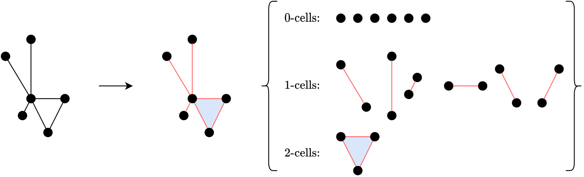
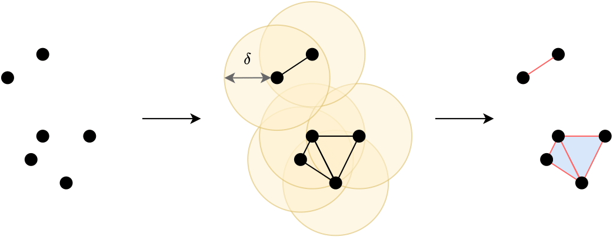

## 1 Introduction

Over the past few years, deep learning research has seen significant progress in solving graph learning tasks. A crucial aspect of such problems is maintaining equivariance to transformations, such as rotations and translations, allowing for instance, to reliably predict physical properties of molecules. In this section, we will provide an overview of the predominant methods used in this domain, along with an introduction to a new method: E(n) Equivariant Simplicial Message Passing Networks (EMPSNs) [3].

Graph Neural Networks (GNNs) [13], namely their most common variant, Message Passing Neural Networks (MPNNs) [5] are instrumental for learning on graph data. Simple MPNNs however, have a number of drawbacks. Firstly, they are limited in their ability to learn higher-dimensional graph structures such as cliques (a set of points that are all connected to each other), since communication normally only happens from nodes to other nodes. Secondly, they suffer from over-smoothing; nodes of a graph iteratively update their features by aggregating the features of their neighbors, a process by which updated node features become increasingly similar. Previous works attempt to improve MPSNs’ expressivity by considering higher-dimensional simplices in the graph as learnable features [1] [8]. While these methods provide the tools for more powerful graph learning models, they do not concern themselves with equivariance.

As stated in the original EMPSN [3] paper, many real-life problems have a natural symmetry to translations, rotations, and reflections (that is, to the Euclidean group E(n)), such as object recognition or predicting molecular properties. Many approaches have been proposed to ensure E(n) equivariance: Tensor field networks [14], SE(3) Transformers [4], E(n) Equivariant Graph Neural Networks [12] among others. These works are particularly useful for working with geometric graph data, such as molecular point clouds; they use the underlying geometry of the space in which the graph is positioned to ensure E(n) equivariance. In this case, however, the lack of higher-dimensional features remains a limiting factor for the reasons stated previously. EMPSNs [3] are a novel approach to learning on geometric graphs and point clouds that is equivariant to the euclidean group E(n) (rotations, translations, and reflections). The method combines geometric and topological graph approaches to leverage both benefits. Its main contributions related to our reproduction study are the following:

1. A generalization of E(n) Equivariant Graph Neural Networks (EGNNs), which can learn
features on simplicial complexes.
2. Experiments showing that the use of higher-dimensional simplex learning improves perfor-
mance compared to EGNNs and MPSNs without requiring more parameters and proving
to be competitive with SOTA methods on the QM9 dataset [11], [10].

Additionally, their results suggest that incorporating geometric information serves as an effective
measure against over-smoothing.

In our work, we attempt to reproduce the results of the original EMPSN paper and extend the
method, rewriting parts of the author’s code to use a common suite for learning on topological
domains. The suite allows us to test how a different graph lifting procedure (an operation
that obtains higher-order simplices from graph data) compares to the one used in the original
paper.

## 2 Theoretical background

Message passing neural networks have seen an increased popularity since their introduction [5].
In this blogpost, we will elaborate on how message passing networks are adapted to work with
simplicial complexes, as proposed by [3]. We introduce the relevant definitions of message pass-
ing, simplicial complexes, equivariant message passing networks and message passing simplicial
networks.

### 2.1 Message passing
Let $G = (V,E)$ be a graph consisting of nodes $V$ and edges $E$. Then let each node $v_i \in V$ and edge $e_{ij} \in E$ have an associated node feature $\mathbf{f}_i \in \mathbb{R}^{c_n}$ and edge feature $\textbf{a}_{ij} \in \mathbb{R}^{c_e}$, with dimensionality $c_n, c_e \in \mathbb{N}_{>0}$. In message passing, nodes have hidden states (features). We update nodes' features iteratively via the following procedure:
$$\mathbf{m}_{i j}=\phi_m\left(\mathbf{f}_i, \mathbf{f}_j, \mathbf{a}_{i j}\right) \tag{1}$$
$$\mathbf{m}_i=\underset{j \in \mathcal{N}(i)}{\text{Agg}} \mathbf{m}_{i j} \tag{2}$$
$$\mathbf{f}_i^{\prime}=\phi_f\left(\mathbf{f}_i, \mathbf{m}_i\right) \tag{3}$$

First, we find messages from $v_j$ to $v_i$ (equation 1). We then aggregate messages to $v_i$, with $\text{Agg}$ being any permutation invariant function over the neighbors (equation 2). Finally, we update the hidden state (features) of all nodes $\mathbf{f}_i$ (equation 3). $\mathcal{N}(i)$ denotes the set of neighbours of node $v_i$, and $\phi_m$ and $\phi_f$ are multi-layer perceptrons. This sequence of steps is one iteration and is performed by what we call a message-passing layer.

After passing our input graph's features through several successive message-passing layers, permutation-invariant aggregation is applied to all final hidden states of the nodes in order to get a hidden state that represents the entire graph.

### 2.2 Simplicial complexes

A simplex in Geometry is the extension of the concept of triangles to multiple dimensions. An
n-simplex consists of n+1 fully connected points, i.e. a 0-simplex is a point, a 1-simplex is a line,
a 2-simplex is a triangle, a 3-simplex is a tetrahedron, a 4-simplex is a 5-cell, etc. In an article
entitled Architectures of Topological Deep Learning: A Survey of Message-Passing Topological
In Neural Networks [9], simplices are mainly referred to as cells of rank r (r-cells for short),
where for example, a 1-simplex is a 1-cell. To assign features to higher-dimensional simplices
in graphs, we turn to the definition of a generalized notion of graphs called abstract simplicial
complexes.

We define an abstract simplicial complex (ASC) $\mathcal{K}$ as a collection of non-empty finite subsets of some set $\mathcal{V}$ such that for every set $\mathcal{T} \in \mathcal{K}$ and any non-empty subset $\mathcal{R} \subseteq \mathcal{T}$, it is the case that $\mathcal{R} \in \mathcal{K}$. Although an ASC is a purely combinatorial object, we can use the definition to associate a set of points of some graph $\mathcal{G}$ to a higher-order structure, using a so-called **lifting transformation**. 

As an example, we may consider clique complex lifting, as described in [3]: Formally, the lift results in the ASC $\mathcal{K}$ with the property that if the nodes $\{v_0,\ldots,v_k\}$ form a clique in $\mathcal{G}$, then the simplex $\{v_0,\ldots,v_k\} \in \mathcal{K}$. In other words, any clique in the graph that is comprised of $k$ nodes becomes a $k$-simplex. The resulting ASC conforms to the provided definition in the sense that if an edge is in the simplicial complex, so are its nodes; if a triangle is in the complex, so are its edges and nodes; and so on. 

An $n$-dimensional simplicial complex is defined as one that contains simplices of dimension/rank $\leq n$. In the scope of our study (and that of the original paper), using the cell terminology mentioned previously, we only consider 2-dimensional simplicial complexes (2-cells, or triangles, are the highest rank $r$-cells in the complex). An illustration of clique complex lifting is provided in figure 1.

_Figure 1: Illustration of clique complex lifting, in the resulting simplicial complex, we have the nodes (0-cells) of the original graph in black, the edges (1-cells) of the original graph in red and the triangles (2-cells) in blue._

Unfortunately, clique complex lifting can be computationally expensive, and an alternative called the Vietori-Rips lift is described in the original paper. We start from a point cloud (points with positions in 3D euclidean space only) and we obtain a simplicial complex by assigning an r-cell to sets of points that are within a predefined distance $\delta$ away from each other. More specifically, we iterate through each point; if a sphere with radius $\delta$ around the point contains $r$ points, they are connected, and an r-cell is assigned to that set of points. No duplicate r-cells should be present in the result. An illustration is provided in figure 2.

_Figure 2: Vietoris-Rips lift._

We may also consider alpha complex lifting; the alpha complex is a fundamental data structure from computational geometry. 

In the alpha complex, a subset $ \sigma = \{x_{i0},...,x_{ik} \}\subset S$ belongs to $\text{Alpha}(S,r)$ if there exists a point $y \in \mathbb{R}^m$ that is equidistant from every member of $\sigma$, so that 
$$
\rho := || y- x_{i0}||=...=||y-x_{ik}|| \leq r
$$
and thus $||y-x|| \leq r\ \ \  \forall x \in S$. 

Formally, the alpha complex is defined as the collection:
$$
\text{Alpha}(S, r)=\left\{\sigma \subset S: \bigcap_{x \in \sigma} V_x(r) \neq \emptyset\right\}
$$
A subset $\sigma $ of size $k+1$ is called a $k$-dimensional simplex of $\text{Alpha}(S,r)$. [@carlsson_computing_2023]

### 2.3 Equivariant Message Passing Networks

Firstly, it is important to define what equivariance is. Suppose $G$ is a group and $X$ and $Y$ are sets on which $G$ acts. A function $f: X \rightarrow Y$ is called equivariant with respect to $G$ if it commutes with the group action. In other words, applying a transformation $g \in G$ followed by the function $f$ yields the same result as first applying $f$ and then the transformation. Formally, 

$$
\begin{align*}
& f(g \cdot x)=g \cdot f(x) && \text {equivariance} \\
& f(g \cdot x)=f(x) &&\text {invariance}
\end{align*}
$$

A frequently utilized model for geometric graphs is the $E(n)$ Equivariant Graph Neural Network (EGNN). This model enhances the message-passing process by incorporating positional data while maintaining equivariance to $E(n)$ [12]. This is crucial because, in certain scenarios, the nodes within a graph are located in Euclidean space, creating what is known as a geometric graph. This spatial information can be integrated into the message-passing framework to incorporate physical attributes to leverage geometric data. The message function is adapted to depend on $E(n)$ invariant information, such as the distance between two nodes. Consequently, the initial step in the message-passing process is modified as follows:

$$
\mathbf{m}_{ij}=\phi_m\left(\mathbf{f}_i, \mathbf{f}_j, \text{lnv}\left(\mathbf{x}_i, \mathbf{x}_j\right), \mathbf{a}_{ij}\right)
$$

having that for all $g \in E(n)$

$$
\text{lnv}\left(g \cdot \mathbf{x}_i, g \cdot \mathbf{x}_j\right)=\text{lnv}\left(\mathbf{x}_i, \mathbf{x}_j\right)
$$

Then, for every layer, the position of the nodes is updated as follows:

$$
\mathbf{x}_i^{\prime}=\mathbf{x}_i+C \sum_{j \neq i}\left(\mathbf{x}_i-\mathbf{x}_j\right) \phi_x\left(\mathbf{m}_{ij}\right)
$$

where $\phi_x$ is a MLP. This positional update is typically unused for $E(n)$-invariant tasks such as predicting the internal energy of a molecule.

### 2.4 Message passing simplicial networks

We denote $\sigma \prec \tau$ when a simple $\sigma$ is on the boundary of a simplex $\tau$ if an only if $\sigma \subset \tau$ and there is no $\delta$ such that $\sigma \subset \delta \subset \tau$.
In other words, $\sigma$ is directly on the boundary (immediately adjacent) of $\tau$ with any intermediate simplices between them.
Message Passing Simplicial Networks (MPSNs) offer a message-passing framework that considers more complex forms of adjacency between objects in an abstract simplicial complex (ASC). Specifically for our paper, the following types of adjacency are identified:
\begin{itemize}
1. Boundary adjacency's $\mathcal{B}(\sigma)=\{\tau \mid \tau \prec \sigma\}$ (e.g. if $\sigma$ is a triangle, the simplices that are boundary-adjacent to it are its edges.)
2. Upper-adjacency's $\mathcal{N}_{\uparrow}(\sigma)=\{\tau \mid \exists \delta, \tau \prec \delta \wedge \sigma \prec \delta\}$ (e.g. if $\sigma$ is a triangle, a upper-adjacent simplex could be another triangle that shares a common edge with $\sigma$)

Then, as we saw in \ref{messpass}, the messages from adjacent simplices have to be aggregated to a simplex $\sigma$. For example, all boundary-adjacent simplex messages are aggregated as follows:
$$\mathbf{m}_{\mathcal{B}}(\sigma)=\underset{\tau \in \mathcal{B}(\sigma)}{\text{Agg}}\left(\phi_{\mathcal{B}}\left(\mathbf{f}_\sigma, \mathbf{f}_\tau\right)\right)$$
for $\phi_{\mathcal{B}}$ is a MLP. Alternatively, we incorporate the 2 message types in the updates as follows:
$$\mathbf{f}_\sigma^{\prime}=\phi_f\left(\mathbf{f}_\sigma, \mathbf{m}_{\mathcal{B}}(\sigma), \mathbf{m}_{\mathcal{N}_{\downarrow}}(\sigma) \right) $$
Lastly, for a $k$ dimensional simplicial complex $\mathcal{K}$
$$\mathbf{h}_{\mathcal{K}}:=\bigoplus_{i=0}^k \text{Agg}_{\substack{\sigma \in \mathcal{K},|\sigma|=i+1}} \mathbf{h}_\sigma$$
where $\mathbf{h}_{\mathcal{K}}$ is the hidden state representing the entire complex, and $\bigoplus$ is the concatenation. For clarity, if the network then updates the positions of the nodes in each layer, this makes the network E(n) equivariant; if the network solely passes the invariant information without altering the geometric locations then it's just E(n) invariant.

